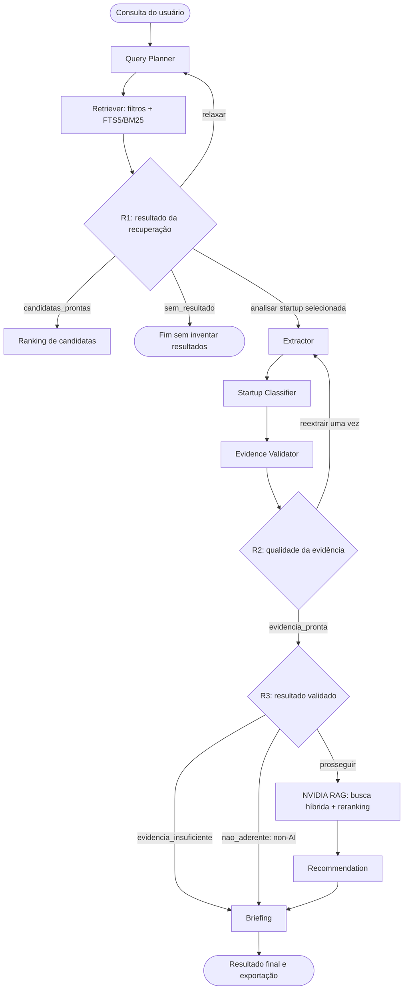
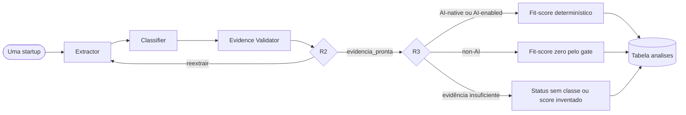

# NVIDIA AI Radar

Sistema multiagente para descobrir startups brasileiras, conferir o que fontes públicas realmente sustentam e identificar oportunidades de aproximação com a NVIDIA.

O usuário descreve em linguagem natural o tipo de empresa que procura. O radar recupera candidatas de uma base curada, combina a relação com a busca com um fit-score NVIDIA baseado em evidências e, sob demanda, produz uma análise aprofundada com recomendações rastreáveis e briefing exportável.

> O sistema não completa informações ausentes nem transforma suposições em fatos. Quando a evidência é insuficiente, essa limitação aparece como resultado.

## Índice

- [O que o projeto entrega](#o-que-o-projeto-entrega)
- [Como usar](#como-usar)
- [Fluxo completo](#fluxo-completo)
- [Arquitetura de software](#arquitetura-de-software)
- [RAG NVIDIA](#rag-nvidia)
- [Evidência, recomendação e fit-score](#evidência-recomendação-e-fit-score)
- [Dados e persistência](#dados-e-persistência)
- [Estrutura do projeto](#estrutura-do-projeto)
- [Instalação do zero](#instalação-do-zero)
- [Testes e avaliações](#testes-e-avaliações)
- [Decisões técnicas e diferenciais](#decisões-técnicas-e-diferenciais)
- [Limitações conhecidas](#limitações-conhecidas)
- [Correspondência com o TAPI](#correspondência-com-o-tapi)

## O que o projeto entrega

- Busca de startups por uma pergunta aberta, como “empresas brasileiras que usam visão computacional em saúde”.
- Ranking de candidatas com controle para priorizar fit-score NVIDIA ou relação textual com a busca, além de filtro por classe.
- Classificação fundamentada em `AI-native`, `AI-enabled` ou `non-AI`.
- Validação determinística dos trechos públicos usados como evidência.
- RAG híbrido sobre uma base local de conhecimento NVIDIA, com reranking e citações.
- Recomendações de tecnologias NVIDIA ligadas a evidências dos dois lados.
- Briefing executivo em três desfechos honestos: análise completa, `non-AI` ou evidência insuficiente.
- Interface Streamlit com Radar, Dashboard, visão detalhada e exportação do briefing em Markdown.

## Como usar

1. Abra a interface e descreva a empresa que deseja encontrar.
2. Examine as candidatas e escolha a ordenação: maior fit-score NVIDIA ou maior relação com a busca. Também é possível filtrar por `AI-native`, `AI-enabled` ou `non-AI`. O índice textual participa da ordenação, mas não é exibido como uma segunda nota.
3. Selecione uma startup e peça a análise aprofundada.
4. Consulte a síntese, as evidências confirmadas, as necessidades ou oportunidades e as recomendações NVIDIA.
5. Baixe o briefing em Markdown quando quiser registrar ou compartilhar o resultado.

O Dashboard mostra um panorama da base e das análises persistidas. Uma análise feita ao abrir uma startup pode divergir do ranking salvo caso novas respostas dos provedores encontrem evidências diferentes; a interface sinaliza essa situação e privilegia a leitura atual.

## Fluxo completo

O produto separa a jornada em duas invocações. A primeira descobre e ordena candidatas. A segunda aprofunda somente a startup escolhida, evitando gerar dezenas de briefings que talvez nunca sejam lidos.



### Responsabilidade de cada etapa

- **Query Planner:** transforma a pergunta em um plano estruturado com termos e filtros aceitos pela base. Em relaxamentos, amplia o plano de forma controlada.
- **Retriever:** aplica filtros SQL parametrizados e busca textual FTS5/BM25. Ele encontra documentos e empresas; não classifica nem recomenda.
- **R1:** decide se há candidatas suficientes, se a consulta deve ser relaxada, se não houve resultado ou se uma startup selecionada deve ser aprofundada.
- **Extractor:** lê apenas os documentos recuperados da startup escolhida e extrai afirmações estruturadas com trechos literais e identificadores de origem.
- **Startup Classifier:** recebe somente o perfil extraído e propõe uma classe com os identificadores das afirmações que a sustentam.
- **Evidence Validator:** recarrega os documentos permitidos, confere deterministicamente os trechos e deriva lacunas sem chamar LLM ou rede.
- **R2:** autoriza uma reextração controlada quando muita evidência cai ou o suporte da classificação é inválido.
- **R3:** separa evidência insuficiente, empresa `non-AI` e empresa que pode seguir para o RAG NVIDIA.
- **NVIDIA RAG:** recupera e reordena conhecimento técnico NVIDIA relevante para o perfil validado.
- **Recommendation:** cruza necessidades ou sinais confirmados com passagens NVIDIA e resolve prioridade, complexidade e lastro.
- **Briefing:** é a única saída final do aprofundamento. Consolida a análise normal ou explica honestamente os desfechos alternativos.

Todos esses passos compartilham um estado tipado no LangGraph. Checkpoints SQLite preservam o andamento sem misturar esse histórico ao banco de negócio.

## Arquitetura de software

### Grafo principal e grafo de lote

O grafo principal atende a busca e o aprofundamento. Um grafo menor reaproveita o mesmo Extractor, Classifier, Evidence Validator e os mesmos roteadores para pré-analisar as 30 startups.



O lote não chama Query Planner, NVIDIA RAG, Recommendation ou Briefing. Sua função é manter um cache regenerável para que o ranking apareça rapidamente. A busca calcula a relação com a consulta atual, enquanto o fit-score vem da análise persistida. Por padrão, resultados concluídos aparecem antes dos insuficientes ou ausentes e seguem por fit-score, BM25, nome e identificador. Na interface, o usuário pode priorizar a relação com a busca: atributos escritos explicitamente, como setor, estágio ou localização, vêm antes da proximidade lexical BM25. Isso preserva a intenção original mesmo quando a recuperação precisa ampliar um filtro para produzir alternativas. Também é possível limitar a lista a uma classe; nenhuma dessas escolhas recalcula o fit-score, cria uma nota combinada ou chama um modelo.

### Fronteiras principais

- **Contratos Pydantic:** cada agente recebe e devolve estruturas fechadas; campos extras ou referências inválidas são rejeitados.
- **Camada de aplicação:** coordena descoberta, ranking e aprofundamento sem colocar decisões de domínio no Streamlit.
- **Fronteira SQLite:** centraliza leituras parametrizadas, curadoria, índices e cache de análises.
- **Fronteira de provedores:** mantém Gemini, Groq e serviços NVIDIA fora da lógica dos agentes e permite testes por injeção.
- **Interface:** apenas apresenta objetos já validados, controla a sessão e exporta o mesmo conteúdo exibido.

## RAG NVIDIA

RAG, ou *Retrieval-Augmented Generation*, significa “geração apoiada por recuperação”. Em vez de pedir que o modelo responda somente de memória, o sistema primeiro procura trechos relevantes em uma base conhecida e entrega esses trechos como contexto.

Neste projeto, 19 páginas NVIDIA foram sintetizadas em arquivos Markdown dentro de `conhecimento/fontes/`. Cada arquivo mantém metadados como URL original, data de acesso, origem e tecnologia. O conteúdo local torna a ingestão reproduzível; as URLs preservam a rastreabilidade.

O caminho de recuperação é:

1. Os documentos são divididos por seções semânticas, respeitando um teto de tamanho.
2. A API NVIDIA transforma cada trecho em um vetor de 2.048 dimensões.
3. O SQLite guarda texto, metadados, índice FTS5 e vetores por meio do `sqlite-vec`.
4. A consulta faz uma busca lexical FTS5 e uma busca vetorial por significado.
5. O Reciprocal Rank Fusion, ou RRF, combina as duas listas sem confundir suas escalas.
6. Um reranker NVIDIA reordena os melhores candidatos considerando a consulta completa.
7. Os seis trechos finais chegam ao agente de recomendação com seus identificadores e fontes.

Os corpora nunca se misturam:

- `dados/base/` contém evidências públicas sobre startups;
- `conhecimento/fontes/` contém conhecimento técnico NVIDIA.

Uma recomendação precisa citar evidência da startup e conhecimento NVIDIA resolvido. Um trecho conceitual pode ajudar a explicar, mas não pode ser o único lastro técnico de uma tecnologia.

## Evidência, recomendação e fit-score

### Evidência antes da conclusão

O Extractor produz afirmações com trecho literal e identificador do documento. O validador recarrega somente os documentos recuperados para aquela startup e aceita diferenças apenas de caixa e espaços colapsados. Isso confirma a **proveniência do trecho**, não transforma automaticamente a alegação da fonte em verdade universal.

Informação desconhecida não equivale a ausência. Uma lacuna só existe quando a evidência confirmada sustenta `gap_confirmado`; conflitos permanecem `desconhecido`. Afirmações derrubadas não classificam, não pontuam e não geram recomendação.

Gemini é o provedor LLM principal. Se `GROQ_API_KEY` estiver configurada, Groq funciona como reserva apenas em falhas operacionais elegíveis. A troca de provedor não afrouxa schema, validação, isolamento ou regras de evidência. Cada agente permite no máximo uma correção de saída estruturada; se ainda falhar, nenhum resultado fictício é criado.

### Recomendações rastreáveis

Cada recomendação representa uma lacuna confirmada ou uma oportunidade técnica confirmada. Ela contém:

- afirmações validadas da startup;
- uma a três tecnologias do catálogo NVIDIA permitido;
- ao menos uma citação técnica NVIDIA compatível;
- prioridade e complexidade calculadas por regras determinísticas;
- justificativas de negócio e técnica;
- próxima ação sugerida.

Sem lastro dos dois lados, a recomendação é descartada.

### Fit-score NVIDIA

O fit-score não é uma nota de qualidade da empresa. Ele mede a aderência comercial e técnica à stack NVIDIA encontrada nas fontes públicas.

Os quatro pilares são:

1. centralidade da IA;
2. lacuna endereçável confirmada;
3. momento da empresa;
4. alinhamento setorial.

A soma bruta tem máximo 36 e é normalizada por `round(100 × soma / 36)`. Pontuações altas exigem evidência e, quando aplicável, corroboração entre domínios distintos. Uma classificação `non-AI` validada aciona um gate global de zero. Um score baixo pode ser a conclusão correta quando não há dor, urgência ou lacuna comprovada.

## Dados e persistência

### Base de startups

Cada JSON em `dados/base/` representa uma startup e reúne campos estruturados e documentos públicos curados. Os documentos registram tipo, título, síntese original, URL, domínio, data de publicação quando disponível e data de acesso. A carga valida URLs, vocabulários e diversidade de domínios antes de escrever no SQLite.

O campo `classe_referencia` existe somente para avaliação offline da curadoria. Ele não entra nos contratos de aplicação e não é fornecido aos agentes.

### Bancos locais

- `dados/radar.db`: startups, documentos, FTS5, conhecimento NVIDIA, vetores e cache regenerável de análises.
- `dados/checkpoints.db`: checkpoints de execução do LangGraph.

Os dois arquivos são gerados localmente e ignorados pelo Git. Por isso, um clone novo precisa inicializar a base, ingerir o conhecimento NVIDIA e gerar o cache antes de oferecer toda a experiência.

### Escala verificada

| Item | Quantidade |
|---|---:|
| Startups curadas | 30 |
| Documentos públicos de startups | 91 |
| Análises persistidas | 30 |
| Fontes Markdown NVIDIA | 19 |
| Tecnologias NVIDIA cobertas | 16 |
| Chunks NVIDIA | 74 |
| Registros FTS NVIDIA | 74 |
| Vetores NVIDIA | 74 |
| Consultas rotuladas para avaliação do RAG | 12 |

Alice possui quatro documentos; por isso a contagem correta da base é 91, não 90.

## Estrutura do projeto

```text
IA-PS/
├── app.py                         # Entrada única da interface Streamlit
├── .streamlit/                    # Tema e configuração visual
├── radar/
│   ├── agentes/                   # Agentes, validador e roteadores R1/R2/R3
│   ├── conhecimento_nvidia/       # Ingestão, chunking e busca híbrida do RAG
│   ├── interface/                 # Sessão, textos, rótulos, tema e exportação
│   ├── aplicacao.py               # Casos de uso de descoberta e aprofundamento
│   ├── base_startups.py           # Fronteira SQLite, FTS5 e cache de análises
│   ├── configuracao.py            # Caminhos, modelos e limites explícitos
│   ├── contratos.py               # Schemas Pydantic e estado do LangGraph
│   ├── grafo.py                   # Grafo principal e grafo auxiliar de lote
│   ├── lote.py                    # Execução e persistência da pré-análise
│   ├── provedores.py              # Adaptadores Gemini, Groq e NVIDIA
│   ├── recomendacao.py            # Função pura do fit-score
│   └── regras_recomendacao.py     # Catálogos e regras determinísticas
├── dados/
│   ├── base/                      # 30 JSONs de startups curadas
│   └── avaliacao_rag.json         # 12 consultas rotuladas do RAG
├── conhecimento/fontes/           # 19 fontes NVIDIA em Markdown
├── scripts/                       # Inicialização, ingestão, lote e avaliações
├── tests/                         # Suíte offline e adversarial
├── docs/DOCUMENTS.md              # Notas técnicas complementares
├── .env.example                   # Nomes das variáveis, sem credenciais
├── .python-version                # Versão de Python testada
└── requirements.txt               # Dependências diretas fixadas
```

Para detalhes das decisões e invariantes, consulte [docs/DOCUMENTS.md](docs/DOCUMENTS.md).

## Instalação do zero

### Pré-requisitos

- Git;
- Python 3.14.4;
- conexão com a internet para instalar pacotes e executar operações com APIs;
- `GOOGLE_API_KEY` para os agentes LLM;
- `NVIDIA_API_KEY` para embeddings, busca vetorial e reranking;
- `GROQ_API_KEY` opcional para reserva operacional dos agentes LLM.

Não é necessário instalar Docker, PostgreSQL, Qdrant ou outro banco vetorial externo.

### 1. Clonar e criar o ambiente

No Windows PowerShell:

```powershell
git clone https://github.com/PedroMelo1910/InteliAcademyPS.git
cd InteliAcademyPS
py -3.14 -m venv .venv
.\.venv\Scripts\Activate.ps1
python -m pip install --upgrade pip
python -m pip install -r requirements.txt
Copy-Item .env.example .env
```

No macOS ou Linux:

```bash
git clone https://github.com/PedroMelo1910/InteliAcademyPS.git
cd InteliAcademyPS
python3.14 -m venv .venv
source .venv/bin/activate
python -m pip install --upgrade pip
python -m pip install -r requirements.txt
cp .env.example .env
```

Se o PowerShell bloquear a ativação, é possível executar os comandos diretamente com `./.venv/Scripts/python.exe -m ...` sem alterar a política global do computador.

### 2. Configurar as chaves

Abra o `.env` criado e preencha localmente:

```dotenv
GOOGLE_API_KEY=
GROQ_API_KEY=
NVIDIA_API_KEY=
```

Aspas não são necessárias. `GROQ_API_KEY` é opcional; as outras duas são necessárias para a experiência completa. Nunca envie o `.env` ao GitHub.

### 3. Preparar os dados locais

Execute na ordem:

```powershell
python -m scripts.inicializar_base
python -m scripts.ingerir_conhecimento --validar
python -m scripts.ingerir_conhecimento
python -m scripts.analisar_lote
python -m scripts.analisar_lote --executar
```

O que acontece:

1. `inicializar_base` valida os 30 JSONs, cria `dados/radar.db` e monta o FTS5 das startups. É offline.
2. `ingerir_conhecimento --validar` confere manifesto, metadados, chunking e cobertura das 16 tecnologias. É offline.
3. `ingerir_conhecimento` calcula embeddings via NVIDIA e grava os índices lexical e vetorial. Faz chamadas externas e exige `NVIDIA_API_KEY`.
4. `analisar_lote` mostra apenas quantas chamadas podem ser feitas; não chama modelos nem atualiza o cache.
5. `analisar_lote --executar` pré-analisa as startups e persiste o ranking. Usa Gemini e, se configurado e necessário, Groq. O caminho feliz estima duas invocações LLM por startup, mas correções e reextração podem elevar esse total.

Não execute o lote completo novamente sem necessidade. Para limitar o trabalho:

```powershell
# Somente startups ainda ausentes no cache
python -m scripts.analisar_lote --somente-ausentes --executar

# Somente uma startup
python -m scripts.analisar_lote --startup-id 4 --executar
```

### 4. Iniciar a interface

```powershell
python -m streamlit run app.py
```

Abra o endereço local exibido no terminal, normalmente `http://localhost:8501`. Mantenha o terminal aberto enquanto usa a aplicação.

## Testes e avaliações

### Suíte offline

No PowerShell:

```powershell
python -m pytest -q -p no:cacheprovider --basetemp="$env:TEMP\ia-ps-pytest"
```

No macOS ou Linux:

```bash
PYTEST_TMP="$(mktemp -d)"
python -m pytest -q -p no:cacheprovider --basetemp="$PYTEST_TMP/basetemp"
```

Resultado verificado: **1.472 testes aprovados e um aviso de depreciação em biblioteca externa**.

A suíte bloqueia chamadas de rede acidentais e injeta provedores controlados. Ela cobre contratos, agentes, rotas do grafo, SQL parametrizado, RAG, fit-score, cache, ranking, segurança do Markdown, exportação e jornada da interface.

### Verificações que usam APIs

Os comandos abaixo não fazem parte da suíte offline e podem consumir cota:

```powershell
python -m scripts.smoke_embedding_nvidia
python -m scripts.smoke_rerank_nvidia
python -m scripts.avaliar_recuperacao
```

- Os smokes confirmam acesso aos modelos NVIDIA de embedding e reranking.
- A avaliação compara a fusão híbrida RRF com o pipeline final — reranking e guarda de cobertura — em 12 consultas rotuladas manualmente.
- O último comando exige `NVIDIA_API_KEY`; seu fallback de reranking também pode usar `GOOGLE_API_KEY`.

## Decisões técnicas e diferenciais

- **Evidência primeiro:** a conclusão precisa apontar para afirmações, documentos e trechos verificáveis.
- **Abstenção honesta:** falha de provedor, evidência insuficiente e empresa `non-AI` têm desfechos distintos; nenhum deles recebe conteúdo fabricado.
- **Determinismo onde importa:** validação de proveniência, roteamento, fit-score, prioridade e complexidade não são delegados ao LLM.
- **RAG híbrido local:** FTS5, sqlite-vec, RRF e reranking coexistem no mesmo banco sem depender de infraestrutura externa adicional.
- **Separação de medidas:** a relação com a busca preserva atributos explícitos da pergunta e usa o BM25 como desempate lexical; o fit-score responde à aderência NVIDIA. A interface permite escolher qual perspectiva ordena a lista sem transformá-las em uma nota combinada.
- **Rastreabilidade bilateral:** recomendações ligam fonte pública da startup a fonte técnica NVIDIA.
- **Cache regenerável:** o ranking completo fica rápido sem gerar antecipadamente RAG, recomendações e briefings para todas as empresas.
- **Resiliência controlada:** Groq pode substituir Gemini em falhas operacionais elegíveis; clientes NVIDIA são iniciados somente quando o RAG é usado, sem bloquear a descoberta textual.
- **Testabilidade:** a arquitetura usa fronteiras explícitas para executar toda a suíte sem rede.

## Limitações conhecidas

- A base contém 30 startups selecionadas e curadas manualmente; não existe scraping em execução. Coleta automatizada está fora do escopo deste projeto.
- Os fatos refletem as datas de acesso registradas nos documentos e podem ficar desatualizados em relação às páginas públicas.
- A experiência ao vivo depende da disponibilidade, da cota e das permissões dos provedores externos.
- Groq é uma reserva opcional dos agentes LLM. Ele não substitui os serviços NVIDIA de embedding e reranking.
- Não existe integração com Cerebras na implementação atual.
- Os bancos locais e caches devem ser regenerados quando dados curados ou contratos incompatíveis mudarem.
- Saídas de modelos podem variar; contratos e validadores limitam essa variação, mas não prometem disponibilidade de 100%.

## Correspondência com o TAPI

| Requisito | Implementação |
|---|---|
| Sistema multiagente com LangGraph | Grafo tipado com agentes especializados, três decisões condicionais, reextração e checkpoints |
| RAG NVIDIA com reranking | Corpus NVIDIA local, embeddings, FTS5, sqlite-vec, RRF, reranker e citações |
| Motor de recomendação | Evidência bilateral, tecnologias permitidas, prioridade, complexidade e fit-score determinístico |
| Interface web | Streamlit com Radar, Dashboard, aprofundamento, fontes e visualização de recomendações |
| Exportação | Briefing final baixável em Markdown |
| Diferencial | Validação de evidência, abstenção honesta, cache ranqueável e rastreabilidade ponta a ponta |

O vídeo de entrega deve demonstrar a interface funcionando e explicar, em até sete minutos, a arquitetura dos agentes e do RAG. A documentação apoia essa explicação, mas não substitui a demonstração real.
