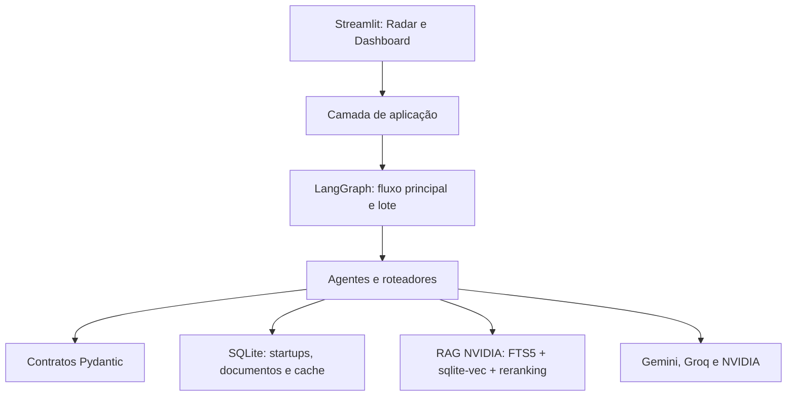
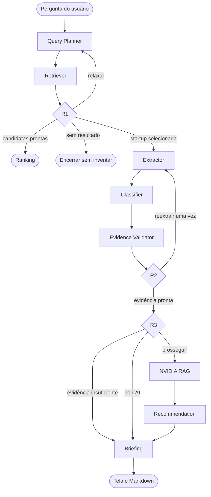
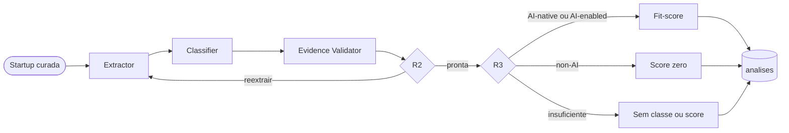
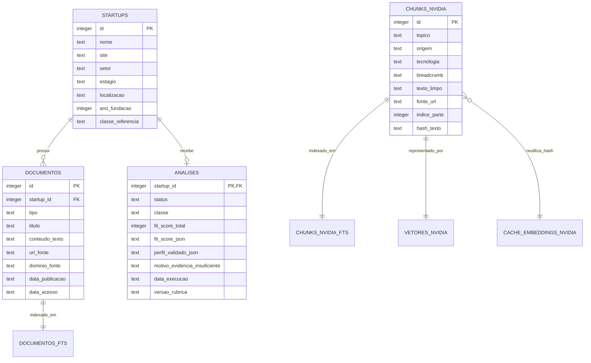

# Documentação técnica — NVIDIA AI Radar

[Voltar ao README](../README.md)

Este documento reúne, em um único arquivo, os quatro guias necessários para
compreender, instalar, operar e defender tecnicamente o projeto. O
[README](../README.md) apresenta o produto e o caminho rápido; aqui ficam os
detalhes que precisam acompanhar o código.

## Índice

1. [Arquitetura](#parte-1--arquitetura)
2. [Dados e persistência](#parte-2--dados-e-persistência)
3. [Instalação e configuração](#parte-3--instalação-e-configuração)
4. [Uso, testes e operação](#parte-4--uso-testes-e-operação)

---

# Parte 1 — Arquitetura

## 1. Objetivo e escopo

O NVIDIA AI Radar recebe uma descrição em linguagem natural, encontra
startups brasileiras relacionadas, verifica o que as fontes públicas sustentam
e identifica oportunidades de aproximação com tecnologias NVIDIA.

O projeto implementa os quatro núcleos técnicos exigidos pelo TAPI:

- sistema multiagente com LangGraph;
- RAG NVIDIA com busca híbrida, reranking e citações;
- motor de recomendação;
- interface web com visualização e exportação de briefing.

A coleta automatizada de páginas não faz parte da execução. O TAPI permite uma
base previamente populada, portanto as startups foram curadas em JSON a partir
de fontes públicas. O sistema analisa essa base; ele não navega na web para
descobrir empresas durante uma pesquisa.

## 2. Visão por camadas



- `app.py` apresenta resultados e recebe ações do usuário.
- `radar/aplicacao.py` coordena descoberta, ranking e aprofundamento.
- `radar/grafo.py` conecta os nós e as decisões condicionais.
- `radar/agentes/` contém responsabilidades isoladas.
- `radar/contratos.py` define tudo que pode circular entre as etapas.
- `radar/base_startups.py` é a única fronteira da base de startups.
- `radar/conhecimento_nvidia/` implementa ingestão e recuperação do RAG.
- `radar/provedores.py` adapta serviços externos aos contratos internos.

## 3. Fluxo principal

A jornada é dividida em duas invocações. A primeira encontra candidatas. A
segunda aprofunda somente a startup escolhida, evitando custo e latência para
gerar briefings que talvez não sejam abertos.



### Query Planner

Transforma a pergunta em `PlanoConsulta`, com termos e filtros pertencentes ao
vocabulário real da base. Em uma tentativa de relaxamento, remove restrições
de forma controlada. Não acessa documentos nem recomenda tecnologias.

### Retriever

Executa SQL parametrizado, filtros estruturados e FTS5/BM25. Devolve empresas,
documentos e scores lexicais. Não recebe o gabarito de classificação.

### R1

Decide, nesta ordem: aprofundar uma startup selecionada; entregar candidatas
quando existe quantidade útil; relaxar uma busca estreita; entregar resultado
parcial após o teto; ou encerrar quando o conjunto continua vazio.

### Extractor

Lê somente os documentos recuperados da startup selecionada. Produz um
`PerfilExtraido` com afirmações estruturadas, trecho literal, documento de
origem, polaridade e sinais técnicos. O texto integral dos documentos não é
carregado no estado do LangGraph.

### Classifier

Recebe apenas `PerfilExtraido` e devolve classe, justificativa e os
identificadores das afirmações de suporte. As classes são `AI-native`,
`AI-enabled` e `non-AI`. O campo `classe_referencia` nunca chega a esse agente.

### Evidence Validator

É determinístico: não chama LLM nem rede. Recarrega apenas os documentos
referenciados e recuperados, confere os trechos por caixa e espaços colapsados,
preserva o isolamento de startup/documento e deriva o estado das lacunas.

Confirmar a proveniência significa confirmar que o trecho está na fonte
armazenada; isso não transforma a alegação da página em verdade universal.

### R2

Autoriza uma única reextração quando a taxa de evidência derrubada ultrapassa o
limiar ou quando a classificação depende de uma afirmação não confirmada. O
teto impede loops e custo ilimitado.

### R3

Separa três resultados:

- `evidencia_insuficiente`: não há suporte confirmado suficiente;
- `nao_aderente`: a classe `non-AI` foi confirmada;
- `prosseguir`: uma empresa aderente pode consultar o RAG NVIDIA.

### NVIDIA RAG

Monta uma consulta técnica a partir do perfil validado, executa recuperação
lexical e vetorial, combina as listas, aplica reranking e entrega seis trechos
citáveis. O corpus NVIDIA nunca é misturado com os documentos das startups.

### Recommendation

O LLM produz somente rascunhos limitados. O programa confere fundamentos,
resolve evidências e citações e calcula prioridade, complexidade e fit-score.
Uma recomendação precisa de lastro público da startup e lastro técnico NVIDIA.

### Briefing

É a única saída final do aprofundamento. Existem três formas válidas: análise
normal; `non-AI`, com score zero e sem recomendação; ou evidência insuficiente,
sem classe, score ou recomendação fabricada. Tela e exportador consomem o mesmo
objeto `Briefing` validado.

## 4. Grafo de pré-análise

Para o ranking abrir rapidamente, um grafo menor processa as startups antes da
consulta do usuário.



Esse grafo não usa Query Planner, NVIDIA RAG, Recommendation ou Briefing. O
cache é regenerável e não substitui a análise aprofundada.

## 5. Ranking e controles da interface

Duas perspectivas permanecem separadas: a relação com a busca considera os
atributos estruturados escritos na pergunta e a proximidade lexical BM25;
fit-score mede aderência comprovada à stack NVIDIA.

Por padrão, o ranking prioriza análise concluída, fit-score decrescente, BM25,
nome e identificador. No Radar, o usuário pode trocar a ordem para **Maior
relação com a busca**. Nesse modo, uma correspondência explícita de nome,
setor, estágio ou localização vem primeiro; o menor BM25 — maior proximidade
lexical — decide depois. Isso evita perder a intenção original quando a busca
precisa relaxar um filtro para encontrar mais alternativas. O número técnico
não é exibido como uma segunda nota.

Também é possível mostrar todos os perfis ou filtrar por `AI-native`,
`AI-enabled` e `non-AI`. Filtrar ou ordenar não chama modelos, não refaz a
busca, não recalcula scores e não altera o banco.

## 6. Fit-score

O fit-score não avalia a qualidade geral de uma startup. Ele mede oportunidade
comercial e técnica para a stack NVIDIA encontrada nas fontes.

Os pilares são centralidade da IA, lacuna endereçável confirmada, momento da
empresa e alinhamento setorial. A soma bruta máxima é 36 e o total público é
`round(100 × soma_bruta / 36)`. Somente afirmações confirmadas pontuam.
Conflito ou desconhecimento não vira lacuna. Uma classe `non-AI` confirmada
aciona o gate global de zero.

## 7. RAG híbrido e reranking

As 19 fontes NVIDIA em Markdown são divididas em 74 trechos. Cada trecho
mantém tópico, origem, tecnologia, seção, URL, parte e hash.

O pipeline executa chunking por seção, embeddings NVIDIA de 2.048 dimensões,
armazenamento em `sqlite-vec`, busca FTS5/BM25, busca vetorial, fusão RRF com
`k=60`, reranking e seleção de seis trechos citáveis.

`sqlite-vec` foi escolhido no lugar de Qdrant porque o TAPI permite bancos
alternativos, a escala é pequena e um único arquivo reduz dependências na
demonstração. Qdrant não é dependência, reserva ou caminho ativo.

## 8. Provedores e resiliência

Gemini é o LLM principal. Quando `GROQ_API_KEY` está disponível, Groq pode
substituí-lo somente em falhas operacionais elegíveis. Erro de contrato não é
escondido por troca de provedor.

Os cinco pontos com reserva são Query Planner, Extractor, Classifier,
Recommendation e Briefing. Cada agente permite no máximo uma correção de saída
estruturada. Se a resposta continuar inválida, nenhum resultado é inventado.

Embedding e reranking NVIDIA possuem fronteiras separadas. O reranker NVIDIA
possui uma reserva listwise via Gemini; ela mantém o contrato de ordenação e
não simula scores do modelo NVIDIA.

## 9. Invariantes de segurança e evidência

- contratos Pydantic recusam campos extras;
- SQL recebe valores por parâmetros;
- `classe_referencia` serve somente à avaliação offline;
- uma afirmação mantém startup, documento, trecho e identificador;
- documentos de outra empresa são recusados;
- informação desconhecida não equivale a ausência;
- conflitos ficam desconhecidos e preservam os ids envolvidos;
- evidência derrubada não classifica, não pontua e não recomenda;
- falha operacional não é apresentada como evidência insuficiente;
- conteúdo dinâmico é escapado na tela e no Markdown;
- segredos permanecem no `.env`, que não é versionado.

---

# Parte 2 — Dados e persistência

## 10. Fontes de verdade

- `dados/base/*.json`: curadoria versionada das startups;
- `conhecimento/fontes/*.md`: conhecimento NVIDIA versionado;
- `dados/radar.db`: banco local regenerável da aplicação;
- `dados/checkpoints.db`: andamento das execuções do LangGraph;
- `dados/avaliacao_rag.json`: consultas rotuladas para avaliação do RAG.

Os dois bancos `.db` ficam fora do Git. Um clone novo deve regenerá-los.

## 11. Relações principais



## 12. Curadoria das startups

Cada JSON guarda dados estruturados e documentos públicos. Os tipos aceitos
são `site institucional`, `blog`, `notícia`, `vaga`, `perfil de founder` e
`release`.

As validações exigem URL única, domínio normalizado e pelo menos três domínios
distintos por startup. O `conteudo_texto` é uma síntese factual original. Os
agentes trabalham sobre esse texto e precisam devolver os trechos utilizados.

## 13. Tabelas da base de startups

### `startups`

Registro principal da empresa, com índices para filtros. A
`classe_referencia` não faz parte das projeções entregues aos agentes.

### `documentos`

Relação um-para-muitos com startups. A URL é única, o tipo pertence ao
vocabulário fechado e `startup_id` é chave estrangeira com exclusão em cascata.

### `documentos_fts`

Tabela virtual FTS5 ligada a `documentos`. Indexa título e texto e fornece
BM25 para a recuperação lexical.

### `analises`

Cache de pré-análise, uma linha por startup. `concluida` exige classe,
fit-score e perfil validado. `evidencia_insuficiente` exige classe e score
ausentes e um motivo explícito. O schema possui versão e é regenerável.

## 14. Tabelas NVIDIA

- `chunks_nvidia`: trechos e metadados citáveis;
- `chunks_nvidia_fts`: índice lexical NVIDIA;
- `vetores_nvidia`: tabela `vec0` com vetores `float[2048]` e cosseno;
- `cache_embeddings_nvidia`: vetor por hash do texto e modelo;
- `metadados_indice_nvidia`: modelo e dimensão do índice atual.

Consultas manuais a `vetores_nvidia` precisam usar o Python do `.venv`, onde
`sqlite-vec` está instalado.

## 15. Checkpoints

`dados/checkpoints.db` pertence ao `SqliteSaver` do LangGraph. Ele registra o
estado por `thread_id`. O histórico fica separado do banco de negócio para não
contaminar startups, documentos ou análises.

## 16. Escala atual verificada

| Item | Quantidade |
|---|---:|
| Startups | 30 |
| Documentos e URLs únicas | 91 |
| Análises persistidas | 30 |
| Classes de referência | 7 AI-native, 17 AI-enabled e 6 non-AI |
| Fontes NVIDIA | 19 |
| Tecnologias NVIDIA | 16 |
| Chunks, registros FTS e vetores NVIDIA | 74 de cada |
| Consultas de avaliação do RAG | 12 |

Alice possui quatro documentos; as demais possuem três. Por isso o total é 91.

---

# Parte 3 — Instalação e configuração

## 17. Pré-requisitos

- Git;
- Python 3.14.4;
- internet para instalar dependências e executar APIs;
- `GOOGLE_API_KEY` para os agentes;
- `NVIDIA_API_KEY` para embeddings e reranking;
- `GROQ_API_KEY` opcional para reserva operacional.

Docker, PostgreSQL e Qdrant não são necessários.

## 18. Instalação no Windows PowerShell

```powershell
git clone https://github.com/PedroMelo1910/InteliAcademyPS.git
cd InteliAcademyPS
py -3.14 -m venv .venv
.\.venv\Scripts\Activate.ps1
python -m pip install --upgrade pip
python -m pip install -r requirements.txt
Copy-Item .env.example .env
```

Se a ativação for bloqueada, use diretamente o executável, por exemplo:

```powershell
.\.venv\Scripts\python.exe -m scripts.inicializar_base
```

## 19. Instalação no macOS ou Linux

```bash
git clone https://github.com/PedroMelo1910/InteliAcademyPS.git
cd InteliAcademyPS
python3.14 -m venv .venv
source .venv/bin/activate
python -m pip install --upgrade pip
python -m pip install -r requirements.txt
cp .env.example .env
```

## 20. Variáveis de ambiente

Preencha o `.env` sem enviar o arquivo ao Git:

```dotenv
GOOGLE_API_KEY=
GROQ_API_KEY=
NVIDIA_API_KEY=
```

Aspas não são necessárias. Google e NVIDIA são necessárias para a experiência
completa. Groq é opcional.

## 21. Preparação dos dados

```powershell
python -m scripts.inicializar_base
python -m scripts.ingerir_conhecimento --validar
python -m scripts.ingerir_conhecimento
python -m scripts.analisar_lote
python -m scripts.analisar_lote --executar
```

O primeiro comando valida os JSONs, cria o banco e o FTS das startups. O
segundo valida offline as fontes NVIDIA. O terceiro chama a API NVIDIA para
criar o índice. O quarto é apenas uma prévia. O quinto preenche o cache.

Para limitar custo e tempo:

```powershell
python -m scripts.analisar_lote --somente-ausentes --executar
python -m scripts.analisar_lote --startup-id 4 --executar
```

Não repita o lote completo se as 30 análises já estão presentes.

## 22. Verificação da instalação

```powershell
python -m scripts.ingerir_conhecimento --validar
python -m scripts.analisar_lote
python -m pytest -q -p no:cacheprovider --basetemp="$env:TEMP\ia-ps-pytest"
```

## 23. Problemas comuns

### `ModuleNotFoundError: pydantic`

O comando utilizou outro Python. Ative o `.venv` ou use
`.\.venv\Scripts\python.exe`.

### `no such module: vec0`

Uma consulta SQLite foi feita fora do ambiente que possui `sqlite-vec`.

### Chave ausente ou provedor indisponível

Confirme as variáveis no `.env` sem imprimir seus valores. Verifique cota,
conexão e permissões. Groq cobre apenas falhas operacionais elegíveis do Gemini
e não substitui os serviços NVIDIA.

### Erro ao encerrar o Streamlit

Uma mensagem sobre event loop fechado após interromper o servidor pode ocorrer
no Python 3.14. Se a aplicação funcionou antes de ser encerrada, isso não
indica falha do fluxo do radar.

---

# Parte 4 — Uso, testes e operação

## 24. Iniciar a interface

```powershell
python -m streamlit run app.py
```

Abra o endereço exibido no terminal, normalmente `http://localhost:8501`, e
mantenha o terminal em execução.

## 25. Dashboard

O Dashboard apresenta quantidade de startups e análises, distribuição das
classes, faixas de fit-score e setores representados. As métricas vêm do banco;
a tela não recalcula classificação ou pontuação.

## 26. Radar

1. Escreva uma pergunta ou escolha um exemplo.
2. Execute a busca.
3. Escolha **Maior fit-score NVIDIA** ou **Maior relação com a busca**.
4. Se quiser, filtre por `AI-native`, `AI-enabled` ou `non-AI`.
5. Abra uma candidata para análise aprofundada.

Os controles trabalham somente sobre candidatas recuperadas. Trocar a opção
não faz nova chamada de rede nem altera o cache.

## 27. Leitura do resultado

O cartão mostra situação da análise, classe, dados básicos e fit-score. O BM25
não aparece como nota porque sua escala não é comparável ao fit-score.

No aprofundamento, as abas separam visão geral, evidências e recomendações.
Uma análise ao vivo pode divergir do cache se encontrar evidências diferentes;
a interface sinaliza essa situação e apresenta o resultado atual.

## 28. Exportar briefing

O botão **Baixar briefing em Markdown** gera
`briefing_<startup>_<data>.md`. O exportador aceita somente um `Briefing`
validado e preserva os mesmos fatos e fontes da tela.

## 29. Comandos operacionais

| Objetivo | Comando | Usa rede |
|---|---|---|
| Inicializar a base | `python -m scripts.inicializar_base` | não |
| Validar fontes NVIDIA | `python -m scripts.ingerir_conhecimento --validar` | não |
| Ingerir embeddings | `python -m scripts.ingerir_conhecimento` | sim |
| Ver estimativa do lote | `python -m scripts.analisar_lote` | não |
| Executar lote | `python -m scripts.analisar_lote --executar` | sim |
| Avaliar recuperação | `python -m scripts.avaliar_recuperacao` | sim |
| Testar embedding | `python -m scripts.smoke_embedding_nvidia` | sim |
| Testar reranker | `python -m scripts.smoke_rerank_nvidia` | sim |
| Abrir interface | `python -m streamlit run app.py` | durante análises |

## 30. Testes

A suíte offline bloqueia chamadas acidentais à rede e substitui provedores por
implementações controladas. Ela cobre contratos, SQL, agentes, roteadores,
grafos, checkpoints, RAG, reranking, fit-score, fallback, cache, ordenação,
filtros, interface, Markdown e segurança.

Os smokes NVIDIA e a avaliação de recuperação são separados porque consomem
APIs reais.

## 31. Mapa de leitura do código

1. `app.py`: ação do usuário e apresentação;
2. `radar/aplicacao.py`: descoberta, aprofundamento e ranking;
3. `radar/grafo.py`: nós e arestas;
4. `radar/agentes/roteadores.py`: R1, R2 e R3;
5. `radar/agentes/`: trabalho de cada etapa;
6. `radar/contratos.py`: objetos permitidos;
7. `radar/base_startups.py`: SQLite e recuperação;
8. `radar/conhecimento_nvidia/`: RAG;
9. `radar/recomendacao.py`: fit-score;
10. `radar/interface/`: sessão, rótulos, segurança e exportação.

## 32. Limitações declaradas

- a base é manual e reflete as datas de acesso registradas;
- não há scraping durante a execução;
- respostas ao vivo dependem de serviços externos;
- Groq não substitui embeddings ou reranking NVIDIA;
- não existe integração com Cerebras;
- scores conservadores são esperados quando falta evidência confirmada;
- bancos e cache precisam ser regenerados após mudanças incompatíveis.

## 33. Estado esperado para demonstração

Antes do vídeo ou avaliação:

- 30 startups, 91 documentos e 30 análises no banco;
- 74 trechos, registros FTS e vetores NVIDIA;
- chaves configuradas sem serem exibidas;
- busca e aprofundamento de uma candidata testados;
- terminal aberto enquanto o Streamlit é usado;
- nenhum arquivo temporário ou credencial pendente no Git.
